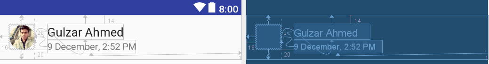
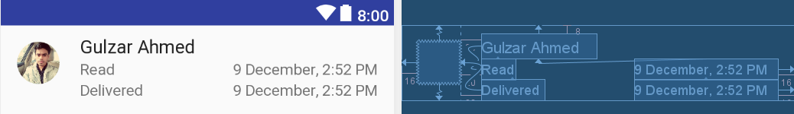

## **WhatsApp Ready Animation**
Implemeting WhatsApp readby animation using ConstraintLayout.


### **Why ?**
Animations in android can be difficult and can lead to writing many lines of code( Different code for exit/enter anim). With the help of Android's new ConstraintLayout 
one can create complex animations by writing few lines of code.

### **How ???**
 - Creating duplicate xml files which contains the start and end postion of the animtions respectively.

`readby_collapsed.xml`|start| 
-------- | --- | --|

`readby_expanded.xml`&nbsp;|end &nbsp;&nbsp; | 
-------- | --- | --|

 - Creating constraint Set for both the layout
```kotlin
val constraintSet1 = ConstraintSet()
val constraintSet2 = ConstraintSet()
constraintSet1.clone(constraintLayout)
constraintSet2.clone(this,R.layout.readby_expanded)

```
- Adding a `TransitionManager` to view the animation 
```kotlin
var changed = false
//Touch Listener
findViewById<View>(R.id.touch).setOnClickListener({
   TransitionManager.beginDelayedTransition(constraintLayout)
   val constraint = if (changed) constraintSet1 else constraintSet2
   constraint.applyTo(constraintLayout)
   changed = !changed
  })
```
- Voilà here's your beautiful animation.
